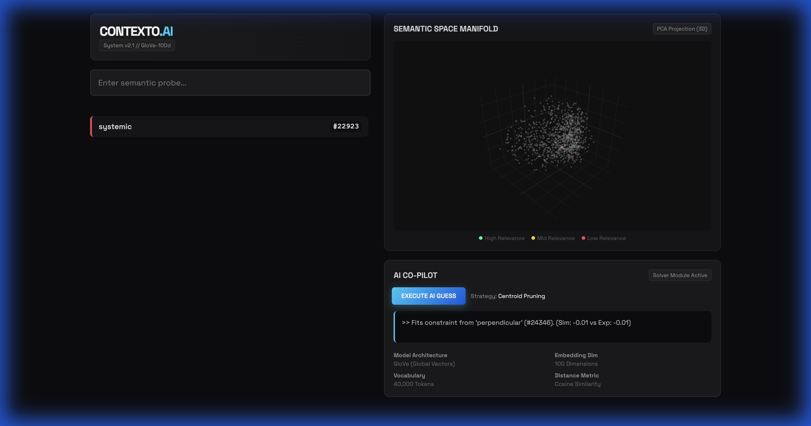

# CONTEXTO.AI


> **System v2.1 // GloVe-100d**
> *Semantic Space Exploration & Neural Navigation System*

## 🌌 Overview

**Contexto.AI** is an advanced semantic search engine disguised as a game. It challenges users to locate a specific target word within a 40,000-dimensional semantic vector space. Unlike traditional word games that rely on spelling or dictionary definitions, Contexto.AI operates on **meaning**.

Powered by **GloVe (Global Vectors for Word Representation)** embeddings, the system calculates the cosine similarity between your guess and the secret target word. A proprietary algorithm ranks your proximity, guiding you through the manifold toward semantic convergence.

This repository features a **state-of-the-art AI Solver** capable of navigating this high-dimensional space autonomously using centroid pruning strategies.

---

## 🚀 Key Features

### 🧠 Semantic Vector Engine
At the core lies `ai_solver.py`, utilizing **NumPy** and **SciPy** to perform lightning-fast vector mathematics. It loads pre-trained GloVe embeddings (100 dimensions) to map the relationships between 40,000 English words.

### 🔮 3D Manifold Visualization
The application renders a real-time, interactive **3D Scatter Plot** of the semantic space using **Plotly.js**.
*   **Dynamic Point Cloud**: Watch as thousands of semantic nodes are plotted in 3D space.
*   **Trajectory Tracking**: Visual lines connect your guesses, showing your path through the word galaxy.
*   **Target Highlights**: The system reveals the exact coordinates of the hidden word upon victory.

### 🤖 Autonomous AI Co-Pilot
Includes a fully integrated AI agent that plays alongside you—or for you.
*   **Auto-Play Mode**: Watch the AI autonomously deduce the target word.
*   **Centroid Pruning Strategy**: The AI calculates the centroid of previous best guesses to triangulate the target vector.
*   **Transparent Reasoning**: The AI explains its "thought process" for every guess (e.g., *"Fits constraint from 'apple' (Sim: 0.72 vs Exp: 0.75)"*).

> **[Full Technical Breakdown: How the AI Works ->](AI_ARCHITECTURE.md)**

### 🎨 Cyber-Futuristic Interface
A premium, dark-mode UI designed for immersion.
*   Neon-accented aesthetics.
*   Responsive layout with fixed sidebars.
*   Real-time feedback loops.

---

## 📸 Demo


*Figure 1: The 3D Manifold visualizing a cloud of semantic neighbors around the target word.*

---

## 🛠️ Installation & Setup

### Prerequisites
*   Python 3.9+
*   Pip
*   Virtual Environment (recommended)

### 1. Clone the Repository
```bash
git clone https://github.com/ryan-rudd/contexto-ai.git
cd contexto-ai
```

### 2. Install Dependencies
```bash
python3 -m venv venv
source venv/bin/activate
pip install -r requirements.txt
```

### 3. Download Model Data
The system requires the GloVe 100d model.
*(Note: Ensure `embeddings.bin` and `vocab.json` are present in the root directory. If utilizing standard GloVe files, run `python scripts/setup_model.py` to convert them).*

### 4. Launch the System
```bash
python app.py
```
Access the interface at `http://localhost:8080`.

---

## 🕹️ Controls

*   **Input Field**: Type any English word to probe the semantic space.
*   **Execute AI Guess**: Trigger the AI to make a single optimal move.
*   **Auto-Play**: Toggle the AI to solve the game automatically.
*   **Orbit/Pan/Zoom**: Interact with the 3D graph to explore word clusters.

---

## 📐 Technical Architecture

**Backend (Flask)**:
*   `app.py`: RESTful API endpoints for game state and vector calculations.
*   `ai_solver.py`: Core logic for vector math, candidate pruning, and next-best-guess selection.

**Frontend (HTML5/JS)**:
*   `index.html`: Single Page Application (SPA) architecture.
*   **Plotly.js**: WebGL-powered 3D rendering.
*   **Fetch API**: Asynchronous communication with the Python backend.

---

## 📜 License

Distributed under the MIT License. See `LICENSE` for more information.
